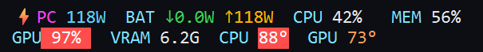

<div align="center">

# ⚡ WattBar

**Monitor de energía y sistema para la barra de tareas de Windows.**
Al estilo *Traffic Monitor*, pero enfocado en los **watts** de tu PC: cuánto **entra**, cuánto **sale** y cuánto consume — en tiempo real.




</div>

Una tira fina, **transparente** y siempre visible que se actualiza cada segundo y muestra el
flujo de energía de la batería (**↓ entra / ↑ sale**), el **consumo total real** del equipo,
y **CPU · RAM · GPU · VRAM · temperaturas**. Se integra en la barra de tareas o flota libre, y
es arrastrable a cualquier monitor.

---

## ⬇️ Descargar

**[⬇️ Bajá el instalador (WattBar-Setup.exe)](https://github.com/nonoskygt/wattbar/releases/latest)** —
no necesitás Python ni instalar dependencias. Instala, crea accesos directos y un desinstalador.

> ¿Preferís desde el código? Mirá [Instalación desde código](#-instalación-desde-código).

## ✨ Características

- 🔋 **Watts que entran / salen** de la batería, medidos de verdad (no estimados).
- ⚡ **Consumo total real** del equipo — exacto a batería; estimado (CPU+GPU reales + base
  **autocalibrada**) cuando está enchufado.
- 🧠 **CPU · RAM · GPU %**, **VRAM** usada y **temperaturas** de CPU y GPU.
- 🟥 **Resalta en rojo** los valores altos (uso o temperatura).
- 🪟 **Dos modos:** *integrado en la barra* (como Traffic Monitor) o *flotante* (arrastrable).
- 🎛️ **1 o 2 líneas**, campos configurables, **transparente**, multi-monitor.
- 🙈 Se **oculta sola** con apps en pantalla completa. 🪶 Liviana (~50–70 MB RAM).

## 📸 Capturas

**2 líneas (bajo carga):**


**1 línea (enchufado — consumo estimado `~`):**


## 🔌 Cómo funciona

| Dato | Fuente |
|------|--------|
| Watts ↓/↑ de batería | WMI `root\wmi BatteryStatus` (`ChargeRate` / `DischargeRate`) |
| CPU % / RAM % | `psutil` |
| GPU % · VRAM · temp. GPU | NVML (`nvidia-ml-py`) |
| Watts y temp. de CPU | [LibreHardwareMonitor](https://github.com/LibreHardwareMonitor/LibreHardwareMonitor) (servidor web JSON) |

A batería, la **descarga es el consumo total real** del equipo. Como Windows no expone la
potencia del CPU a apps normales, para eso (y la temperatura de CPU) WattBar lee
LibreHardwareMonitor. Estando enchufado reutiliza una **base de consumo autocalibrada** a
batería, sumándola a la potencia real de CPU+GPU (por eso el número lleva `~`).

## ▶️ Uso

- **Clic derecho** en la tira (o en el ícono ⚡ de la bandeja) → **Configuración**: modo,
  1/2 líneas, campos, tamaño de fuente, ocultar en pantalla completa e **Iniciar con Windows**.
- **Arrastrá** la tira para moverla (a lo largo de la barra o a otro monitor).
- **Dos modos:**
  - **Integrado en la barra** — dentro de la franja de la barra de tareas, a la derecha.
  - **Flotante** — ventana libre, recuerda su posición.

### Consumo y temperatura de CPU (opcional)

1. `winget install LibreHardwareMonitor.LibreHardwareMonitor`
2. Ejecutá LHM **como administrador** (para leer la potencia del CPU).
3. Activá **Options → Remote Web Server → Run** (puerto 8085).

Sin LHM, WattBar igual funciona: flujo de batería, CPU/RAM/GPU/VRAM y temp. de GPU.

## 💻 Instalación desde código

```powershell
pip install -r requirements.txt   # PySide6, pywin32, psutil, wmi, nvidia-ml-py
pythonw run.pyw
```

## 🧱 Arquitectura

```
wattbar/
  sensors/   battery · system · gpu · power (LHM) · hub (Snapshot)
  ui/        bar (la tira) · settings · theme (formato)
  win/       taskbar (posición / pantalla completa) · tray · autostart
  app.py     QTimer(1s) → hub.read() → bar.update_data()
```

## 📝 Notas

- Enchufado y con la batería llena, el flujo de batería marca ~0 W (no entra ni sale energía).
  El consumo total directo solo se mide a batería; enchufado se estima.
- En Windows 11 la barra de tareas (XAML) no admite incrustar ventanas de otras apps vía
  `SetParent`; el modo *integrado* se logra posicionando la tira flotante dentro de la franja
  de la barra — se ve igual y es robusto en multi-monitor.

## 🧪 Tests

```powershell
python -m pytest -q
```

## 📄 Licencia

[MIT](LICENSE) · Autor: **nonosky**
